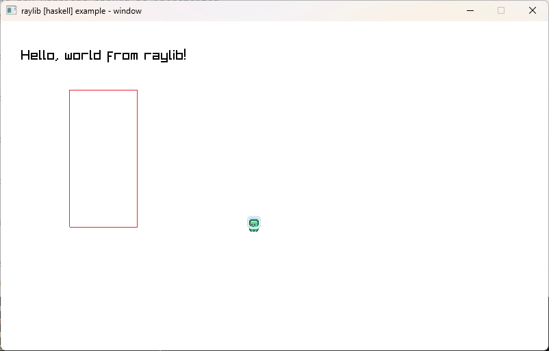

# Haskell Game Jam Template



This is a template repository for a game written in Haskell!

Comments are sprinkled wherever possible to make it easier to understand.

`Main.hs` is a lightweight shell of the program, but the core is in `Game.hs`.
Check out the `updateState` and `drawState` functions for the update/draw logic!

## Using this template

This project has been tested on GHC 8.10.7, 9.4.8, and 9.12.2 on Windows 11 and macOS Sonoma (Arm).

This project uses Raylib as the cross-platform window/graphics abstraction library.

Things should just work out of the box for Mac and Windows. Just clone this
repository and run:

```
cabal run
```

For Linux users, try the above command first. If it fails, you may need to install X11 and retry.

```
sudo apt-get install libx11-dev libxrandr-dev libxi-dev libxcursor-dev libxinerama-dev
```


### Understanding

The project template starts a fixed-FPS game loop (at 60FPS), which handles the movement of a 2D sprite.

Feel free to expand this in any direction you want! (Even 3D is possible if you wrangle with it enough)

You can find examples on Haskell Raylib code here: https://hackage.haskell.org/package/h-raylib-5.1.2.0/src/examples/.
In addition, any Raylib example you see on the internet can be translated easily into Haskell using directly equivalent functions.

### Adding dependencies

To add dependencies to the project, edit the `<project-name>.cabal` file's `build-depends` clause.

### Packaging

Packaging the game can be a little complex if you're on Linux or Mac, since the game binary might contain absolute path references to libraries, which will be broken if you move it to another machine. Please investigate "Raylib game distribution" on your own :(. Best case, a similar procedure to below will work just out of the box.

For Windows:
- Run `cabal list-bin Game` to find where the built binary is
- Copy your game binary, and whatever other assets/resources you need, into a new folder
- Test by double-clicking the game binary to see that it runs.
- ZIP that folder up for distribution.

### Stack

This project does not support using Stack. You can try, but if you already have Cabal installed, it's much quicker to use that.
